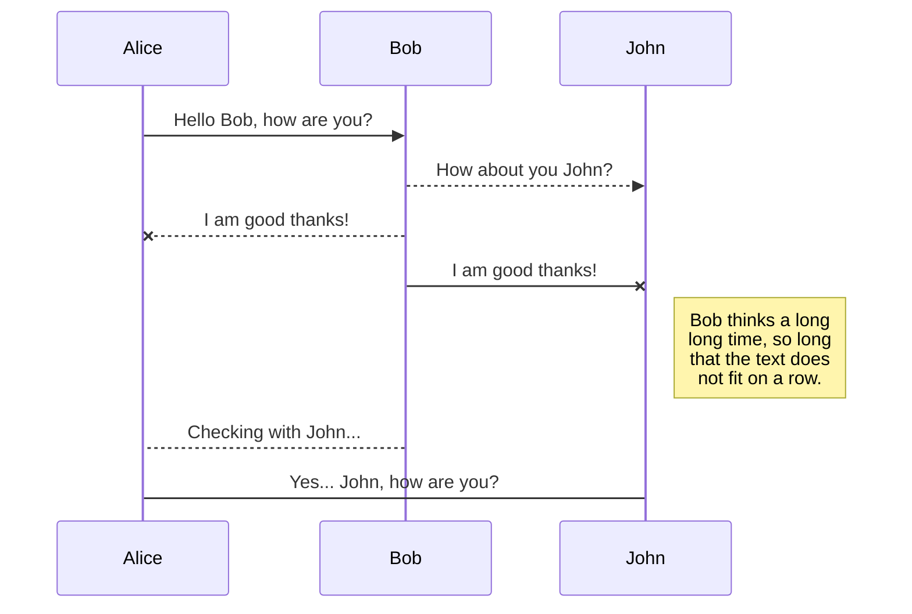

title: test
speaker: zsc
url: https://github.com/zzsscc
js:
    - index.js
    - https://www.echartsjs.com/asset/theme/shine.js
css:
    - index.css
prismTheme: okaidia
plugins:
    - echarts
    - katex
    - mermaid: {theme: forest}

<slide class="bg-black-blue aligncenter" image="https://source.unsplash.com/C1HhAQrbykQ/ .dark">

# test {.text-landing.text-shadow}

By zsc {.text-intro}

[:fa-github: Github](https://github.com/zzsscc){.button.ghost.animated.flipInX.delay-1200}

<slide class="bg-black-blue aligncenter" image="https://source.unsplash.com/n9WPPWiPPJw/ .anim">

test {.animated.fadeInUp.red}
----
test2

```js
;console.log('index')
```

<slide class="bg-black-blue aligncenter" image="bg.jpg .dark">



<slide :class="animated zoomIn delay-500 slow">
## Corporate Backgrounds
:::flexblock {.blink.border}

## .bg-primary {..bg-primary}

\#44d

----

## .bg-secondary {..bg-secondary}

\#67d

----

## .bg-light {..bg-light}

\#edf2f7

----

## body

\#f7f9fb

:::

<slide class="bg-gradient-r aligncenter">
## Radial Gradient

:::{.content-left}
### .background-(position)

:::flexblock {.specs}
::fa-wifi::

## Ultra-Fast WiFi
Simple and secure file sharing.{.animated.tada.delay-500}

---
::fa-battery-full::

## All day battery life
Your battery worries may be over.

---
::fa-life-ring::
## All day battery life
We'll fix it or if we can't, we'll replace it.

:::

:::{.content-right}

需要添加动效的元素添加 `.tobuild` + 动效class {.tobuild.fadeInRight}

`.tobuild` 动效是手动触发的 {.tobuild.fadeInLeft}

- `.build` + `.moveIn`
- `.build` + `.moveIn`
- `.build` + `.moveIn`
- `.build` + `.moveIn`
- `.build` + `.moveIn`
{.build.moveIn}

---

1. **fadeIn**{.bounce}
2. **swing**{.swing}
3. **flash**{.flash}
4. **pulse**{.pulse}
5. **shake**{.shake}
6. **bounceIn**{.bounceIn}
7. **wobble**{.wobble}
8. **fadeInLeft**{.fadeInLeft}
9. **flipInX**{.flipInX}
10. **tada**{.tada}
11. **slideInUp**{.slideInUp}
12. **jello**{.jello}
13. **heartBeat**{.heartBeat}
14. **fadeInUp**{.fadeInUp}
15. **lightSpeedIn**{.lightSpeedIn}
{.text-cols.build}

:::

<slide>
:::column {.vertical-align}

* Html

---
```html {..fadeInUp..slow}
<article id="webslides">
  <!-- Slide 1 -->
  <section>
    <h1>Design for trust</h1>
  </section>
  <!-- Slide 2 -->
  <section class="bg-primary">
    <div class="wrap">
      <h2>.wrap = container (width: 90%)</h2>
    </div>
  </section>
</article>
```
:::